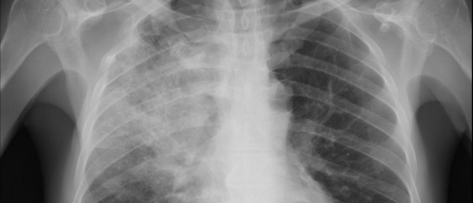

# Classification of Pneumonia in Adults
### Table of Contents
1. [Problem ](#problem)
2. [Data](#data)
3. [Cleaning the Data](#clean)
4. [Methods](#methods)
5. [Results](#results)

### Problem
Fun fact the number one reason adults check into hospitals is for having babies.  Not so fun fact the number two reason is pneumonia.  Unfortunately for the later the disease can be extremely fatal especially to the elderly. The purpose of this capstone was to create a predictive model of improvement or mortality given intake data to the hospital.   

#### Data
For this study a large data set provided by Dryad Digital Repository and consists of 170+ metrics and entries for 2300 patients.  As you can see from a quick snap shot the data contained an extremely large amount of null's and other issues that had to be dealt with.

#### Cleaning of the Data
The first thing done was to convert all yes and no and null values to 1's and 0's.   Additionally for intake viruses and treatments a series of dummy variables were created to make values for this data.  Next because of the large amount of features on the data set PCA was used to better identify feature importance.

#### Methods
##### PCA
In order to get a better scope of the data and the features we are dealing with PCA was used on the data.  The first step being using standard scaler on the data following with a transformation.  Then decomposition's pca was used to create a scree plot as can be seen below:

As you can see not a lot of of variance is explained by the first few principal components.   So a plot was made for the explained variance.  

From the plot we can see that about 26 features account for 90% of the variance.   Therefore when modeling only 26 features were used.

### Results
#### Logistic Regression
Initially the first model selected for this data was Logistic Regression. When testing the initial accuracy it was found to be:
#### 0.85
this also happens to be the ratio of dead to living so this reason for both models a batch of tests were run.

#### Naive Bayes

